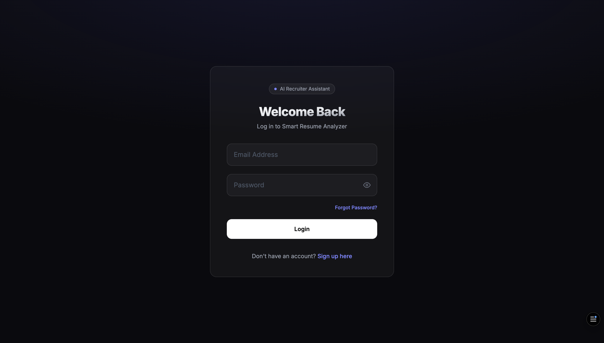
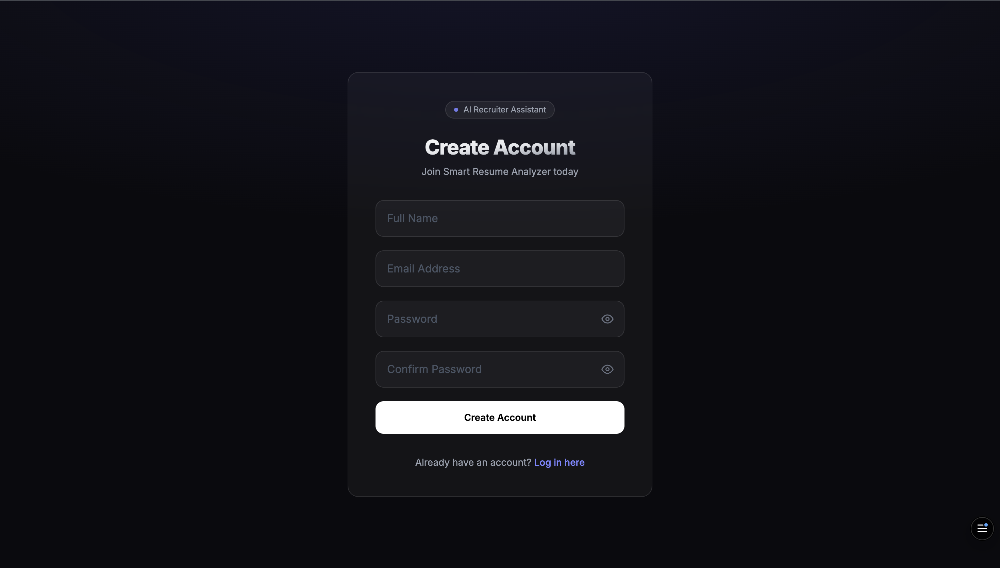
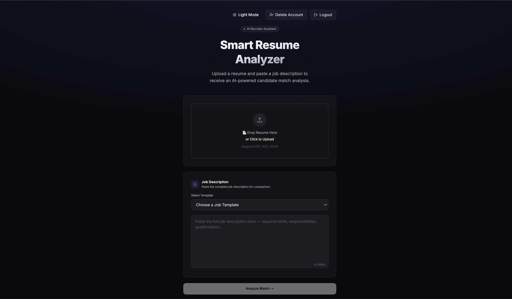
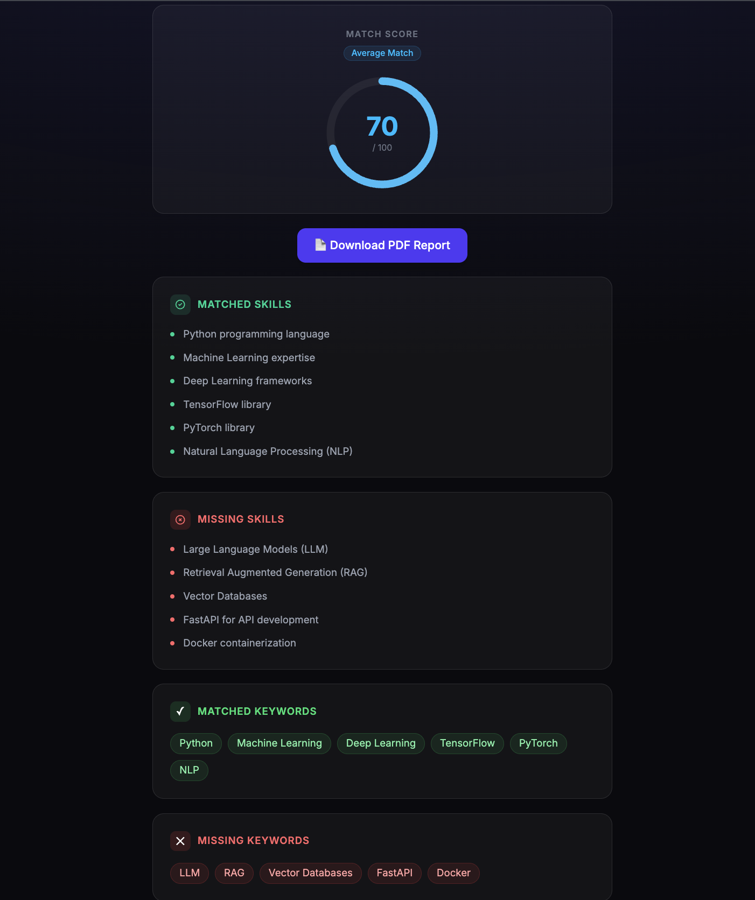
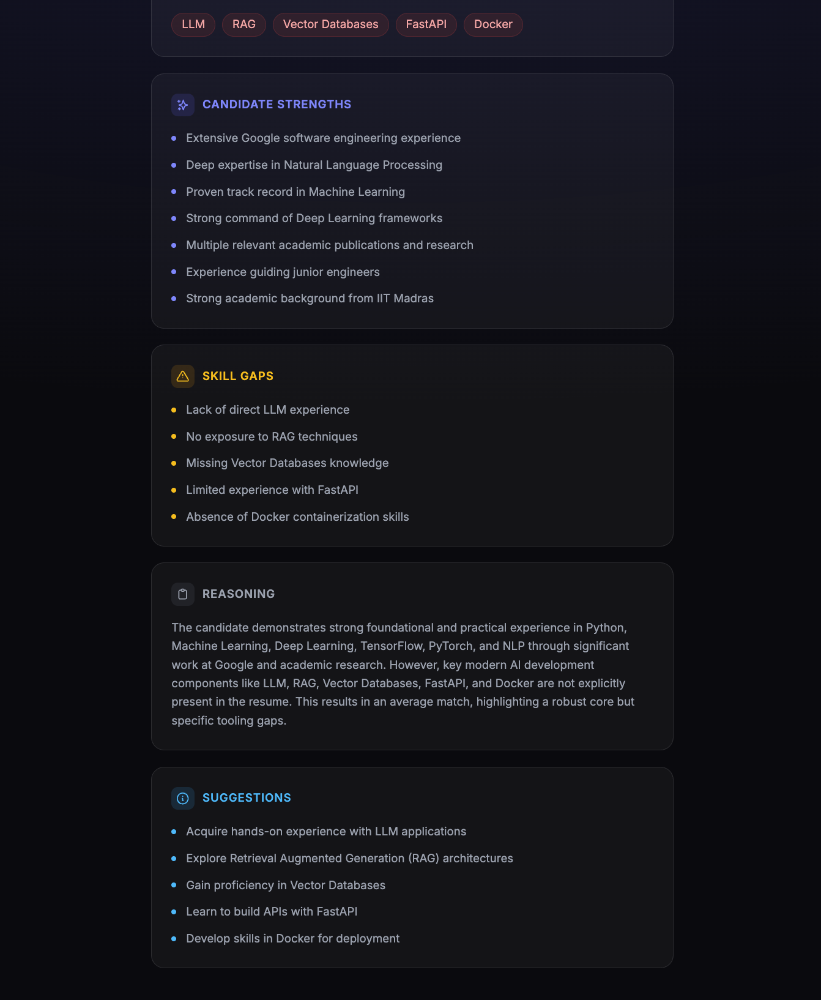
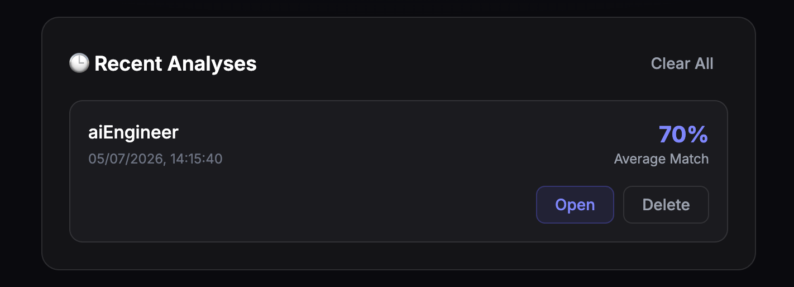

# 🚀 Smart Resume Analyzer

<p align="center">


</p>

An **AI-powered Resume Analyzer** that compares a candidate's resume against a Job Description using **Google Gemini AI** and generates an ATS-style analysis with actionable recruiter insights.

The application helps recruiters and job seekers instantly evaluate resume compatibility through AI-powered skill matching, keyword analysis, recommendations, downloadable PDF reports, and secure user authentication.

---

# 🌐 Live Demo

### Frontend

https://smart-resume-analyzer-pied.vercel.app

### Backend API

https://smart-resume-analyzer-1n57.onrender.com

### GitHub Repository

https://github.com/ShriyanshPandey-702/Smart-Resume-Analyzer

---

# 📑 Table of Contents

- Features
- Tech Stack
- Project Structure
- Installation
- Environment Variables
- Running Locally
- Application Workflow
- Authentication
- PDF Report
- Responsive Design
- Future Improvements
- Screenshots
- Author

---

# ✨ Features

## 🔐 Authentication

- User Registration
- Secure Login
- JWT Authentication
- Forgot Password
- Reset Password
- Delete Account
- Protected Dashboard Routes

---

## 🤖 AI Resume Analysis

- Upload Resume (PDF)
- Drag & Drop Upload
- Paste Job Description
- Pre-built Job Description Templates
- Google Gemini AI Integration
- ATS Match Score
- Recruiter Recommendation
- Matched Skills
- Missing Skills
- Matched Keywords
- Missing Keywords
- Candidate Strengths
- Skill Gap Analysis
- AI Suggestions
- Detailed AI Reasoning

---

## 📊 Dashboard

- Resume Upload
- Job Description Templates
- Analysis History
- Delete Individual Analysis
- Clear Analysis History
- Download PDF Report
- Dark / Light Theme
- Fully Responsive UI

---

# 🛠 Tech Stack

## Frontend

- React.js
- React Router DOM
- Tailwind CSS
- Axios
- React Toastify
- jsPDF

## Backend

- Node.js
- Express.js
- JWT
- Multer
- pdf-parse
- Google Gemini AI

## Database

- MongoDB Atlas
- Mongoose

## Deployment

- Vercel
- Render

---

# 📁 Project Structure

```text
Smart-Resume-Analyzer
│
├── frontend
│   ├── public
│   ├── src
│   │   ├── assets
│   │   ├── components
│   │   ├── context
│   │   ├── pages
│   │   ├── App.jsx
│   │   └── main.jsx
│   └── package.json
│
├── backend
│   ├── config
│   ├── controllers
│   ├── middleware
│   ├── models
│   ├── routes
│   ├── services
│   ├── utils
│   ├── uploads
│   ├── server.js
│   └── package.json
│
└── README.md
```

---

# ⚙️ Installation

## Clone Repository

```bash
git clone https://github.com/ShriyanshPandey-702/Smart-Resume-Analyzer.git
```

```bash
cd Smart-Resume-Analyzer
```

---

## Install Backend Dependencies

```bash
cd backend
npm install
```

---

## Install Frontend Dependencies

```bash
cd frontend
npm install
```

---

# 🔑 Environment Variables

Create a `.env` file inside the **backend** directory.

```env
MONGO_URI=your_mongodb_connection_string

JWT_SECRET=your_secret_key

GEMINI_API_KEY=your_gemini_api_key
```

---

# ▶️ Running Locally

## Start Backend

```bash
cd backend
npm run dev
```

Backend

```
http://localhost:5001
```

---

## Start Frontend

```bash
cd frontend
npm run dev
```

Frontend

```
http://localhost:5173
```

---

# 📊 Application Workflow

1. Register or Login securely.
2. Upload a PDF Resume.
3. Paste or Select a Job Description.
4. Resume text is extracted automatically.
5. Google Gemini AI analyzes the Resume against the Job Description.
6. ATS Match Score is generated.
7. Recruiter insights are displayed.
8. Download the complete PDF Report.
9. Analysis history is stored for future reference.

---

# 🔒 Authentication Flow

- Register
- Login
- Forgot Password
- Reset Password
- JWT Authentication
- Protected Dashboard
- Delete Account

---

# 📄 PDF Report

Each generated report contains:

- ATS Match Score
- Recruiter Recommendation
- Matched Skills
- Missing Skills
- Matched Keywords
- Missing Keywords
- Candidate Strengths
- Skill Gaps
- AI Suggestions
- AI Reasoning

---

# 📱 Responsive Design

Optimized for:

- Desktop
- Laptop
- Tablet
- Mobile

---

# 🚀 Future Improvements

- Email-based Password Reset
- Resume Version Comparison
- Resume Ranking
- Multi-language Resume Support
- Recruiter Dashboard
- Admin Dashboard
- Team Collaboration
- Cloud Resume Storage

---

# 📸 Screenshots

## Login Page



---

## Sign Up Page



---

## Dashboard



---

## AI Analysis Result (Top)



---

## AI Analysis Result (Bottom)



---

## Analysis History



---

# 👨‍💻 Author

**Shriyansh Pandey**

GitHub

https://github.com/ShriyanshPandey-702

LinkedIn

https://www.linkedin.com/in/shriyansh-pandey-40673b348/

---

# ⭐ Support

If you found this project useful, consider giving it a **⭐ Star** on GitHub.

---

# 📄 License

This project is licensed under the MIT License.